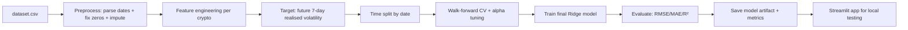

# Pipeline Architecture

```mermaid
flowchart LR
  A[dataset.csv] --> B[Preprocess: parse dates + fix zeros + impute]
  B --> C[Feature engineering per crypto]
  C --> D[Target: future 7-day realised volatility]
  D --> E[Time split by date]
  E --> F[Walk-forward CV + alpha tuning]
  F --> G[Train final Ridge model]
  G --> H[Evaluate: RMSE/MAE/R²]
  H --> I[Save model artifact + metrics]
  I --> J[Streamlit app for local testing]
```
